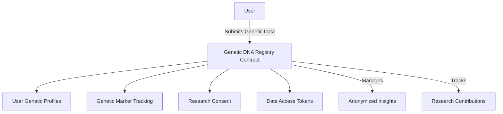

# Genetic Bitcoin: Decentralized Genetic Data Registry

A groundbreaking blockchain platform that enables secure, privacy-preserving genetic data tracking, analysis, and insights while maintaining complete user data sovereignty.

## Overview

Genetic Bitcoin is a decentralized platform for genetic data management that helps users:
- Securely store genetic information
- Analyze genetic markers
- Contribute to scientific research
- Maintain complete control over personal genetic data

The platform features:
- Cryptographically secured genetic data storage
- Privacy-first data sharing mechanisms
- Genetic marker tracking
- Research contribution options
- Blockchain-verified data integrity
- Anonymized data insights

## Architecture

The Genetic Bitcoin system uses a core smart contract to manage genetic data registries and research contributions.



The contract implements key data structures:
- `genetic-profiles`: Stores anonymized genetic data
- `marker-tracking`: Records genetic marker information
- `research-consent`: Manages user research participation
- `data-access-tokens`: Controls data sharing permissions
- `contribution-records`: Tracks research contributions

## Contract Documentation

### Core Functionality

#### Genetic Profile Management
- Secure, principal-based genetic profile creation
- Cryptographic data protection
- Immutable data storage with versioning

#### Genetic Marker Tracking
- Supports various genetic marker types
- Anonymized data representation
- Compliance with genetic privacy standards

#### Research Contribution System
- Opt-in research participation
- Anonymized data sharing
- Transparent contribution tracking

## Getting Started

### Prerequisites
- Clarinet
- Bitcoin-compatible wallet
- Genetic data in compatible format

### Basic Usage

1. Register genetic profile:
```clarity
(contract-call? .genetic-dna-registry register-genetic-profile 
    genetic-hash  ;; Anonymized genetic data hash
    marker-types  ;; Genetic markers to track
    research-consent)  ;; Research participation preference
```

2. Update genetic markers:
```clarity
(contract-call? .genetic-dna-registry update-genetic-markers 
    marker-id  ;; Specific marker identifier
    marker-value)  ;; New marker information
```

## Function Reference

### Public Functions

#### `register-genetic-profile`
Securely register a new genetic profile
```clarity
(register-genetic-profile genetic-hash marker-types research-consent)
```

#### `update-genetic-markers`
Update specific genetic markers
```clarity
(update-genetic-markers marker-id marker-value)
```

#### `grant-research-access`
Provide controlled access to anonymized data
```clarity
(grant-research-access researcher-principal duration)
```

### Read-Only Functions

#### `get-genetic-profile`
```clarity
(get-genetic-profile user) ;; Returns anonymized genetic profile
```

#### `check-marker-compatibility`
```clarity
(check-marker-compatibility marker-type) ;; Validates marker type
```

## Development

### Testing
1. Clone the repository
2. Install Clarinet
3. Run tests:
```bash
clarinet test
```

### Local Development
1. Start Clarinet console:
```bash
clarinet console
```
2. Initialize the registry:
```clarity
(contract-call? .genetic-dna-registry initialize-registry)
```

## Security Considerations

### Data Privacy
- End-to-end encrypted genetic data
- Anonymized profile management
- Granular access control
- No personally identifiable information stored directly

### Genetic Data Limitations
- One-time genetic profile registration
- Markers have strict validation
- Immutable historical records
- Transparent research consent mechanism

### Best Practices
- Use cryptographic hashing for data storage
- Implement multi-factor authentication
- Regular security audits
- Compliance with genetic data regulations